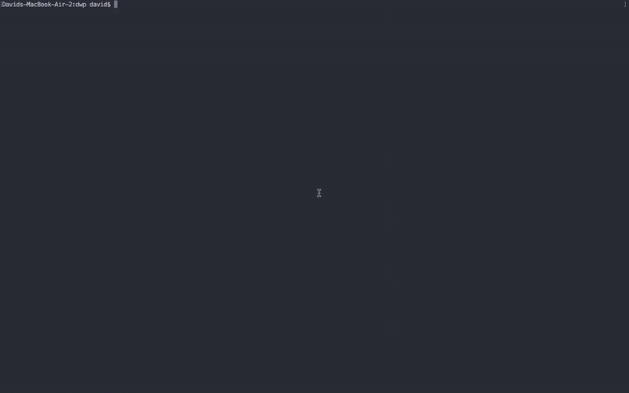
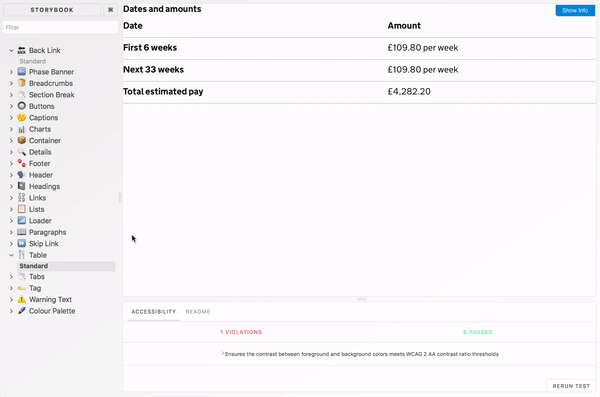

# React Component Library

React framework specific implementations of the [styles/theme](/styles/theme) library, providing numerous components as low-level styled constructs. To do this, we use CSS-in-JS ([styled-components](https://github.com/styled-components/styled-components)) to ensure that components are atomic, with no mapping between components and styles. Consequently, this means making use of this library adds no additional build-time complexity to your React application.

_That said, all components are completely compatible with any pre-existing "SASS Loader" already present in your application, as the library exposes them as standard React components (a la "ready for styling")._

## Getting Started


Let's assume you're getting started with [create-react-app]() and you've created your application. The below steps should help you integrate the library into your application, acting as a good starting point for extending your implementation with the components library.

First, install the necessary dependencies:

```
npm i @dwp/components-theme @dwp/components-react styled-components --save
```

Afterwards, open `src/App.js` file and replace the contents with the following:

```js
// src/App.js
import React, { Component } from 'react';
import { Global, Container, Heading, Header } from '@dwp/components-react';

import Theme from '@dwp/components-theme';

class App extends Component {
  render() {
    return (
      <Global theme={Theme}>
        <Header.Header>
          <Header.Logo />
        </Header.Header>
        <Container lead>
          <Heading.XL>Some Content</Heading.XL>
        </Container>
      </Global>
    );
  }
}

export default App;
```

For customising the application, including modifying the look of the header, see the [storybook](#storybook) instructions below.

### Storybook


All components inside this library have an accompanying storybook, helping you to navigate around each components particular implementation.

Running the storybook locally couldn't be easier, once the repository has been cloned and set up ([see here](/README.md)), simply run `npm run storybook` and navigate to [http://localhost:6006]().

## Visual Regression Testing


This library implements visual regression testing inside Storybook, testing each component inside a headless chrome browser (inside Docker) using [Loki](#TODO).

Before running the tests, ensure that Docker is running on your machine and you have started the Storybook server. Tests can then be executed with `npm run test-storybook`.

#### Updating Reference Images
When working on a component, it may break the test suite. To update the reference images, for a legitimate change, using `./node_modules/.bin/loki update`.
